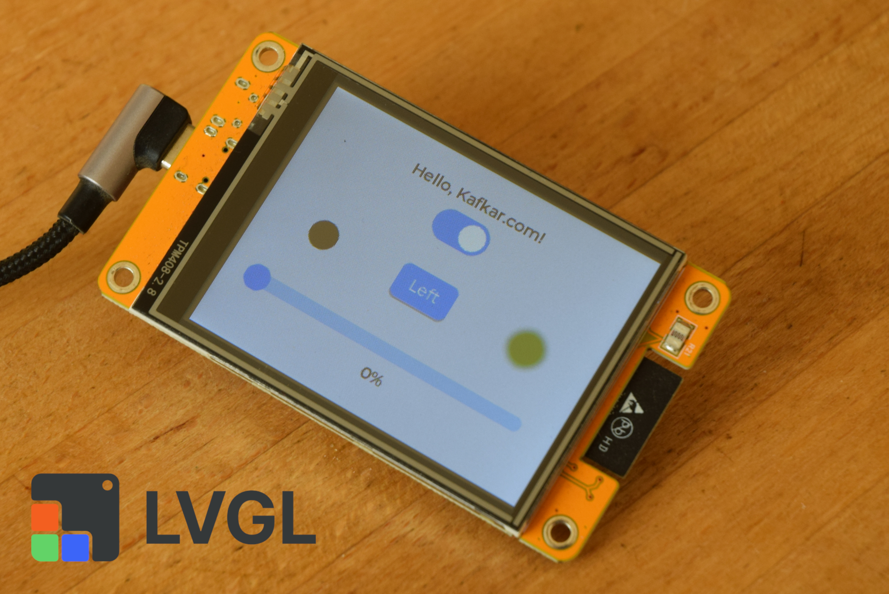

# ESP32_2432S028R-tutorial

 

Tutorial for the ESP32_2432S028R

  

This is a simple tutorial for the ESP32 Cheap Yellow Display Board (CYD) model ESP32-2432S028R and Platform.io. It shows you how to create a basic application that displays information on the screen and uses touch for control.

Detailed description of this tutorial and other projects can be found at https://kafkar.com/projects/smart-home/getting-started-with-esp32-2432s028r-in-platform-io/
